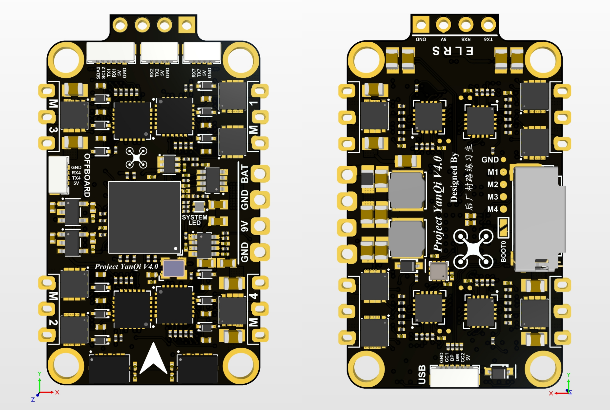

# YanQi Flight Control Board V4.0

**2 x IMU & Baro & 4 x ESC small size PX4 for MAV research.**

<div align=center></div>

## Physical

- Mounting: 20 x 35 mm, Φ 2 mm
- Dimensions: 24 x 42.4 x 6 mm
- Weight: 4.9 g

## Specifications

- MCU: STM32H743VIH6, 480MHz, 2MB Flash
- IMU: BMI088 + BMI088
- Baro: BMP388
- ESC: 4 x Bluejay
- MicroSD Card Slot
- USB
- 5 x UART
- 4 x PWM (DShot)
- 1 x External I2C
- 2 x ADC (Battery Voltage, Battery Current)
- BEC 9V 3A output
- BEC 5V 3A output

## UART Mapping

<div align="center">

| UART | TTY | SerialName | Suggest Funcion | DMA |
| :--: | :-: | :--------: | :-------------: | :-: |
| USART1 | /dev/ttyS0 | GPS1 | GPS | OFF |
| USART2 | /dev/ttyS1 | TEL1 | Data Link | ON |
| UART4 | /dev/ttyS3 | TEL2 | Offboard PC | ON |
| UART5 | /dev/ttyS4 |  RC  | ELRS Receiver | ON |
| UART7 | /dev/ttyS6 | TEL3 | Optical Flow | ON |

</div>

## Getting Start

### Compile Locally

Follow the PX4 standard approach.

#### Bootloader:

```shell
make UCAS_YanQiH7_bootloader
```

#### Firmware:

```shell
make UCAS_YanQiH7_default
```

### Burn Bootloader & Firmware

#### Bootloader:

**Method 1：**

 To enter DFU mode, pull up BOOT0 while connecting the USB cable to your computer.

```shell
make UCAS_YanQiH7_bootloader upload
```

**Method 2：**

 To enter DFU mode, pull up BOOT0 while connecting the USB cable to your computer.

```shell
dfu-util -a 0 --dfuse-address 0x08000000 -D ./build/UCAS_YanQiH7_bootloader/UCAS_YanQiH7_bootloader.bin
```

If the burning tool is not installed, install the dfu util burning toolkit first.

```
sudo apt install dfu-util
```

#### Firmware:

**Method 1：**

```shell
make UCAS_YanQiH7_default upload
```

Connect the flight controller directly to your computer via USB.

The firmware will then proceed through a number of upgrade steps (downloading new firmware, erasing old firmware etc.). Each step is printed to the screen.

Once the firmware has completed loading, the device/vehicle will reboot and reconnect.

**Method 2：**

Start QGroundControl and connect the vehicle.

Select **"Q" icon** > **Vehicle Setup** > **Firmware** (sidebar) to open Firmware Setup.

Connect the flight controller directly to your computer via USB.

Check **Advanced settings** and select the version from the dropdown list.

Select the **Custom Firmware file...** option to install the custom firmware for the flight controller (autodetected).

Click the **OK** button to start the update.

The firmware will then proceed through a number of upgrade steps (downloading new firmware, erasing old firmware etc.). Each step is printed to the screen and overall progress is displayed on a progress bar.

Once the firmware has completed loading, the device/vehicle will reboot and reconnect.

## Setting Up PX4 Configuration Settings

### Power

### MAVLink

### Receiver

